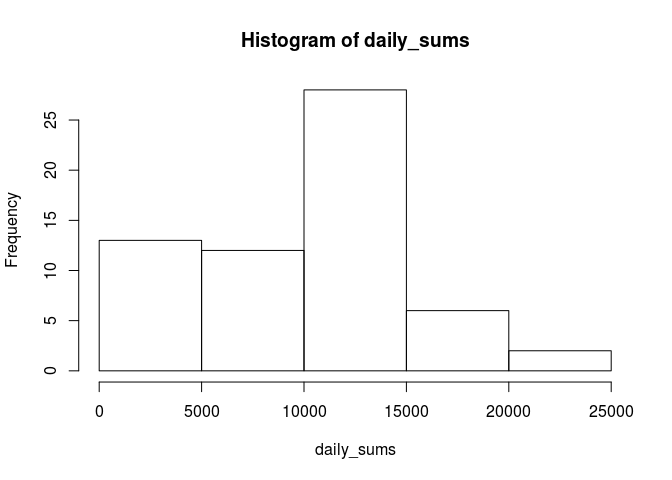
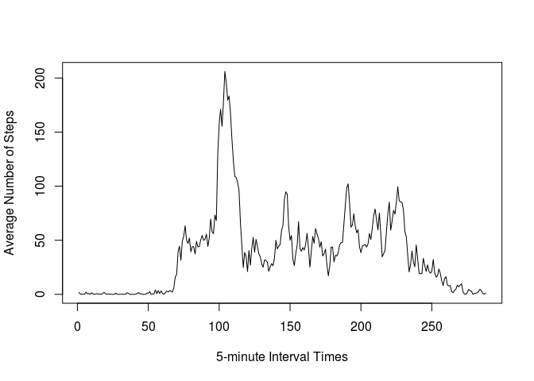
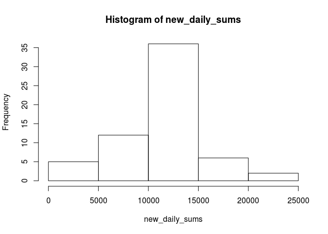
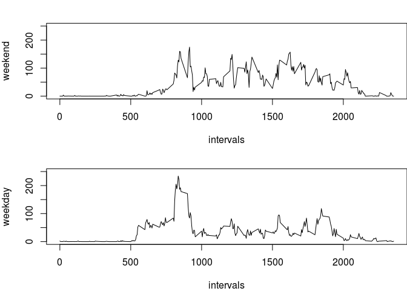

# Reproducible Research: Peer Assessment 1


## Loading and preprocessing the data

```r
unzip("activity.zip")
data <- read.csv("activity.csv")
data$date <- as.Date(data$date)
```


## What is mean total number of steps taken per day?

Here we find the sum of the number of steps for every day.  The summary is displayed below.

```r
daily_sums <- with(data, tapply(steps, date, sum, na.rm = TRUE))
head(daily_sums)
```

```
## 2012-10-01 2012-10-02 2012-10-03 2012-10-04 2012-10-05 2012-10-06 
##          0        126      11352      12116      13294      15420
```
Here we display the histogram of the number of steps taken every day.

```r
hist(daily_sums)
```

 

```r
mean_steps <- round(mean(daily_sums), 2)
median_steps <- median(daily_sums)
```
The mean of the total number of steps taken per day is 9354.23. The median number of steps taken across all days is 10395.

## What is the average daily activity pattern?
Below you see the graph of number of steps averaged across all days for every 5-minute interval time frame.

```r
interval_mean <- with(data, tapply(steps, interval, mean, na.rm = TRUE))
plot(interval_mean, type='l', xlab="5-minute Interval Times", ylab="Average Number of Steps")
```

 
  
Below we find in which 5-minute interval has the average maximum number of steps across all days.

```r
interval_mean[interval_mean == max(interval_mean)]
```

```
##      835 
## 206.1698
```
You can see interval 835 has an average of 206.2 steps over all days.


## Imputing missing values
To impute the missing steps values, here we load the "Hmisc" package and use the function "imputed" to calculate the mean of all the data to use for the NA values.


```r
library(Hmisc)
```

```
## Loading required package: grid
## Loading required package: lattice
## Loading required package: survival
## Loading required package: Formula
## Loading required package: ggplot2
## 
## Attaching package: 'Hmisc'
## 
## The following objects are masked from 'package:base':
## 
##     format.pval, round.POSIXt, trunc.POSIXt, units
```

```r
new_data <- read.csv("activity.csv")
new_data$imputed_steps <- with(new_data, impute(steps, mean))
new_data$date <- as.Date(new_data$date)
```

Below is the new histogram with the imputed data filled in.

```r
new_daily_sums <- with(new_data, tapply(imputed_steps, date, sum, na.rm = TRUE))
hist(new_daily_sums)
```

 

Below we find the new mean and median total number of steps. Then we take the difference from the originals.

```r
new_mean_steps <- round(mean(new_daily_sums), 2)
mean_diff <- round(new_mean_steps - mean_steps, 2)
new_median_steps <- median(new_daily_sums)
median_diff <- new_median_steps - median_steps
```

The mean steps per day taken with the imputed values is 1.076619\times 10^{4}. The difference from the original data is 1411.96.  

The median steps per day taken with the imputed values is 1.0766189\times 10^{4}. The difference from the original data is 371.1886792.  

The impact of the imputed values is that both the mean and the median go up. You can also see from comparing the histograms that the middle of the day seems to be impacted more.

## Are there differences in activity patterns between weekdays and weekends?

First, create a function to tell weekend days from normal weekdays.  Then create a new varible that uses the function to tell the days.

```r
day_type <- function(day) {
    if(day == "Saturday" | day == "Sunday") {
        return("weekend")
    } else {
        return("weekday")
    }
}
new_data$weekday <- weekdays(new_data$date)
new_data$day_type <- lapply(new_data$weekday, day_type)
new_data$day_type <- factor(new_data$day_type, levels=c("weekend", "weekday"))
summary(new_data)
```

```
## 
##  2304 values imputed to 37.3826
```

```
##      steps             date               interval      imputed_steps   
##  Min.   :  0.00   Min.   :2012-10-01   Min.   :   0.0   Min.   :  0.00  
##  1st Qu.:  0.00   1st Qu.:2012-10-16   1st Qu.: 588.8   1st Qu.:  0.00  
##  Median :  0.00   Median :2012-10-31   Median :1177.5   Median :  0.00  
##  Mean   : 37.38   Mean   :2012-10-31   Mean   :1177.5   Mean   : 37.38  
##  3rd Qu.: 12.00   3rd Qu.:2012-11-15   3rd Qu.:1766.2   3rd Qu.: 37.38  
##  Max.   :806.00   Max.   :2012-11-30   Max.   :2355.0   Max.   :806.00  
##  NA's   :2304                                                           
##    weekday             day_type    
##  Length:17568       weekend: 4608  
##  Class :character   weekday:12960  
##  Mode  :character                  
##                                    
##                                    
##                                    
## 
```

Below we create a panel plot. This plot shows the average steps per day taken over every day for weekdays and for weekends separately.


```r
new_data$interval <- as.factor(new_data$interval)
mean_by_day_type <- data.frame(with(new_data, tapply(steps, list(interval, day_type),
                                                     mean, na.rm = TRUE)))
mean_by_day_type$intervals <- levels(new_data$interval)
summary(mean_by_day_type)
```

```
##     weekend           weekday         intervals        
##  Min.   :  0.000   Min.   :  0.000   Length:288        
##  1st Qu.:  1.107   1st Qu.:  2.218   Class :character  
##  Median : 32.036   Median : 23.974   Mode  :character  
##  Mean   : 43.078   Mean   : 35.338                     
##  3rd Qu.: 75.571   3rd Qu.: 51.872                     
##  Max.   :175.000   Max.   :234.103
```

```r
par(mfrow = c(2, 1), mar = c(4, 4, 2, 0))
with(mean_by_day_type, plot(intervals, weekend, type='l', ylim=c(0, 250)))
with(mean_by_day_type, plot(intervals, weekday, type='l', ylim=c(0, 250)))
```

 

You can see by inspecting the y-axis bounds that earlier in the day, more steps are taken during the weekdays than the weekends.  And later in the day, more steps are taken during the weekends than the weekdays.


